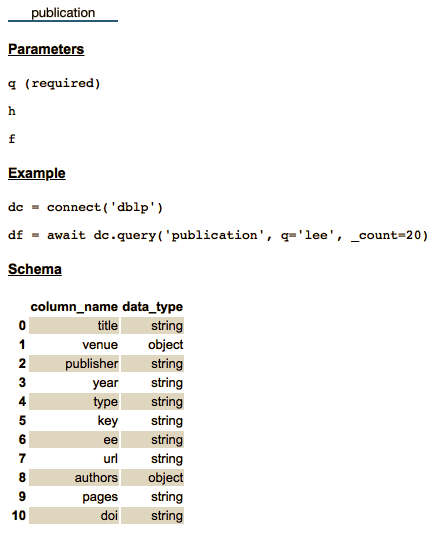
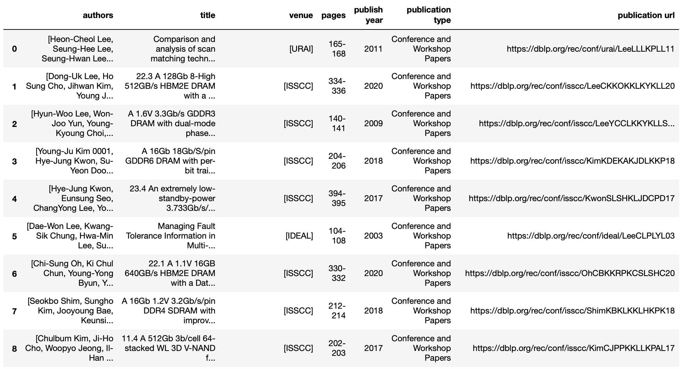
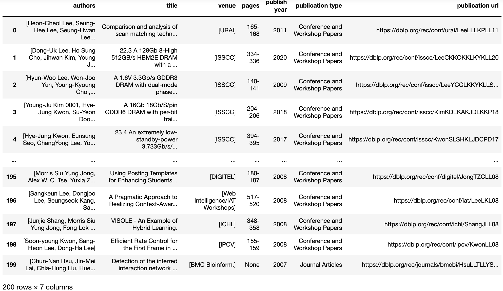
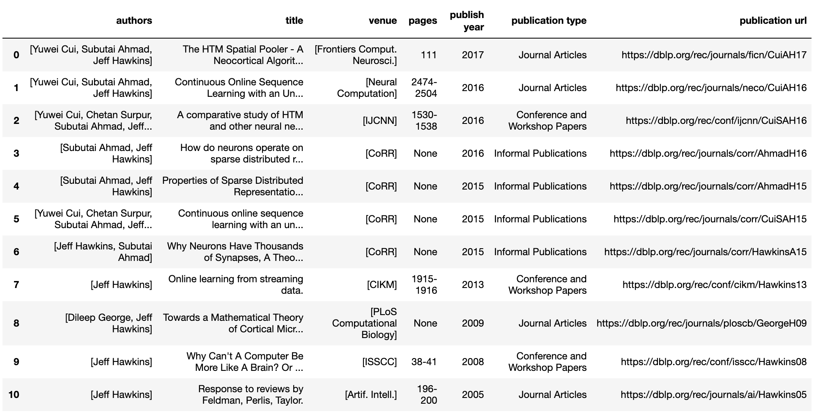

==================================================
Tutorial - Data Connector for DBLP 
==================================================

.. toctree::
   :maxdepth: 2

Overview
========

data_connector is a component in the dataprep library that aims to simplify the data access by providing a standard API set. 
The goal is to help the users skip the complex API configuration. In this tutorial, we demonstrate how to use data_connector library with DBLP.

Preprocessing
================
If you haven't installed dataprep, run command pip install dataprep or execute the following cell.

::

    !pip install dataprep
    

Download and store the configuration files in dataprep 
================================================================
The configuration files are used to construct the parameters and initial setup for the API. The available configuration files can be manually downloaded here: `Configuration Files
<https://github.com/sfu-db/DataConnectorConfigs>`_ or automatically downloaded at usage. 

To automatically download at usage, click on the clipboard button, unsure you are cloning with HTTPS. Go into your terminal, and find an appropriate locate to store the configuration files. 
When you decided on a location, enter the command ``git clone https://github.com/sfu-db/DataConnectorConfigs.git``. This will clone the git repository to the desired location; as a suggestion store it with the dataprep folder. 

From here you can proceed with the next steps.

.. image:: _static/images/tutorial/dc_git.png
	:align: center
   	:width: 1000
   	:height: 500

.. image:: _static/images/tutorial/dc_git_clone.png
	:align: center
   	:width: 725
   	:height: 125

Below the configuration file are stored with dataprep. 

.. image:: _static/images/tutorial/Config_destination.png
	:align: center
   	:width: 586
   	:height: 132

    
Initialize data_connector
=============================
To initialize, run the following code. 

::

    from dataprep.data_connector import Connector
    dc = Connector("./DataConnectorConfigs/DBLP")
    
Functionalities
===================
Data connector has several functions you can perform to gain insight on the data downloaded from DBLP.

Connector.info
------------------
| The info method gives information and guidelines on using the connector. There are 3 sections in the response and they are table, parameters and examples.
|
| 	a. Table - The table(s) being accessed.
| 	b. Parameters - Identifies which parameters can be used to call the method. For DBLP, there is no required **parameter**.
| 	c. Examples - Shows how you can call the methods in the Connector class.

::

    dc.info()
    

Parameters
**********************
| A parameter is a piece of information you supply to a query right as you run it. The parameters for DBLP are **q**, **h**, and **f**, and they are described below.
|
| 	a. **q** - Optional - The query string to search for find author profiles, conferences, journals, or individual publications in the database.
| 	b. **h** - Optional - Maximum number of search results (hits) to return. 
| 	c. **f** - Optional - The first hit in the numbered sequence of search results (starting with 0) to return. In combination with the h parameter, this parameter can be used for pagination of search results.

There are additional parameters to query with DBLP. If you are interested in reading up the other available parameters and setting up your own config files, please read this `DBLP link
<https://dblp.uni-trier.de/faq/13501473>`_ and this `Configuration Files link
<https://github.com/sfu-db/DataConnectorConfigs>`_.

Connector.show_schema
--------------------------
The show_schema method returns the website data in a Dataframe format. There are two columns in the response. The first column is the name and the second is the datatype.
As an example, lets see what is in the publication table.

::

    dc.show_schema("publication")

.. image:: _static/images/tutorial/dc_dblp_show_schema.png
	:align: center
   	:width: 212
   	:height: 295
    
Connector.query
------------------
The query method downloads the website data. The parameters must meet the requirements as indicated in connector.info for the operation to run.

When the data is received from the server, it will either be in a JSON or XML format. The data_connector reformats the data in pandas Dataframe for the convenience of downstream operations.

As an example, let's try to get the data from the "publication" table, providing the query search for "lee".

::

    dc.query("publication", q="lee")
    

    
From query results, you can see how easy it is to download the publication data from DBLP into a pandas Dataframe.
Now that you have an understanding of how data connector operates, you can easily accomplish the task with two lines of code.

::

    dc = Connector(...)
    dc.query(...)

Pagination
===================
| Another feature available in the config files is pagination. Pagination is the process of dividing a document into discrete pages, breaking the content into pages and allow visitors to switch between them. It returns the maximum number of searches to return. 
| 
| To use pagination, you need to include **_count** in your query.

::

    dc.query("publication", q = "lee", _count = 200)

    
Pagination does not concurrently work with the **h** parameter in a query, you need to select either **h** or **_count**.

All publications of one specific author 
=========================================================
| In the query, **q** is a generic search parameter that find author profiles, conferences, journals, or individual publications in the database. As a parameter, **q** is not great when trying to find specific authors and their work. To solve for this issue, you can query the authors first and last name. 
| 
| To fetch all publications of one specific author, you need to include **first_name="______"**, **last_name="______"** in your query.

::

    dc.query("publication", first_name = "Jeff", last_name = "Hawkins")

    
That's all for now.
===================
Please visit the other tutorials that are available if you are interested in setting up a different data connector. 
If you are interested in writing your own configuration file or modify an existing one, refer to the `Configuration Files
<https://github.com/sfu-db/DataConnectorConfigs>`_.