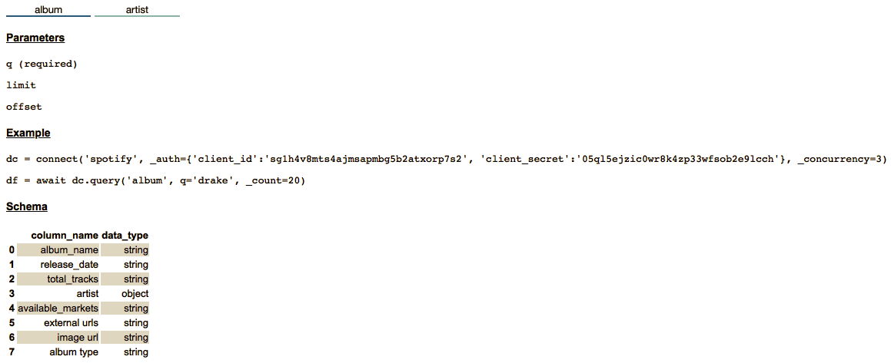

==================================================
Tutorial - Data Connector for Spotify 
==================================================

.. toctree::
   :maxdepth: 2

Overview
========

data_connector is a component in the dataprep library that aims to simplify the data access by providing a standard API set. The goal is to help the users skip the complex API configuration. In this tutorial, we illustrate how to use data_connector library with Spotify.

Preprocessing
================
If you haven't installed dataprep, run command pip install dataprep or execute the following cell.

::

    !pip install dataprep
    
Obtaining access token from Spotify
==================================================
To connect to Spotify, you need to generate a token. This token is a unique identifier of an application requesting access to the Spotify's API. Once an application creates the token, it will act as your credential when making an API request.
To receive an access token the user needs to create a server side application from Spotify. You can create a token by following the `Spotify document
<https://developer.spotify.com/documentation/web-api/>`_, or through the comprehensive guide below.

Start by setting up a Spotify Developer account.

.. image:: _static/images/tutorial/Spotify_authentication.png
	:align: center
   	:width: 700
   	:height: 470

Once an account is created, click the “Dashboard” link and register a new application. Name and describe the application as you want.

.. image:: _static/images/tutorial/Spotify_dashboard.png
	:align: center
   	:width: 600
   	:height: 400

Proceed to `Spotify’s GitHub account
<https://developer.spotify.com/documentation/web-api/>`_ and download/clone the Authentication Flow example app code.
If the clone was successful, a new sub-directory appears on your local drive in the directory where you cloned your repository.

.. image:: _static/images/tutorial/Spotify_git_page.png
	:align: center
   	:width: 650
   	:height: 400

Download and install `Node.js
<https://nodejs.org/en/>`_, if you have not done so already. 

.. image:: _static/images/tutorial/Node_js.png
	:align: center
   	:width: 650
   	:height: 400

Providing the Credentials
---------------------------
In the web-api-auth-examples folder, navigator to the authorization_code folder and there is a file called apps.js.

.. image:: _static/images/tutorial/App_find.png
	:align: center
   	:width: 650
   	:height: 330

Open apps.js with your favourite editor. In the file, it contains a section for client ID, client secret, and redirect URI. Insert the information available in the "white out" section. This is the call that starts the process of authenticating to user and gets the user’s authorization to access data.

.. image:: _static/images/tutorial/App.js_config.png
	:align: center
   	:width: 650
   	:height: 100

The client ID and client Secret can be found in the dashboard app the user generated. The client ID is a public information for applications. The client secret must be kept confidential, it is used to verify that your request made with the client ID are authorized.

.. image:: _static/images/tutorial/ID_and_secret.png
	:align: center
   	:width: 600
   	:height: 350

Go back to the application dashboard and click the edit settings which can be found on the top right. In this section, insert the http link in the redirect_uri, "http://localhost:8888/callback". The redirect URI will safely send the user back to their application once Spotify has authorized the app. Copy and store the access token in a safe area.

.. image:: _static/images/tutorial/URI_.png
	:align: center
   	:width: 300
   	:height: 400

Running the Application
---------------------------
Start the server by running the following command in the terminal:

::

    node app.js

Open a browser and visit the project home page again. Now that the server is running, you can use the following URL: http://localhost:8888.

.. image:: _static/images/tutorial/Spotify_server.png
	:align: center
   	:width: 800
   	:height: 400

When you click on the log in link, it will send you back to your redirect URI. You should see your Spotify account information as well as your access token and refresh token.

.. image:: _static/images/tutorial/SFU_spotify.png
	:align: center
   	:width: 800
   	:height: 400

Download and store the configuration files in dataprep
======================================================

The configuration files are used to configure the parameters and initial setup for the API. The available configuration files can be manually downloaded here: `Configuration Files
<https://github.com/sfu-db/DataConnectorConfigs>`_ or automatically downloaded at usage. 

Store the configuration file in the dataprep folder. 

.. image:: _static/images/tutorial/Config_destination.png
	:align: center
   	:width: 500
   	:height: 120
    
Initialize data_connector
=============================
To initialize the data_connector, run the following code below. Copy and paste the Spotify **access_token**, **client_id**, and **client_secret** in the appropriate variables. Once you have that running, you can use some of the built in functions available in connector.

::

    from dataprep.data_connector import Connector
    client_id = “insert_client_id”
    client_secret = “insert_client_secret”
    access_token = ““insert_token_key”
    dc = Connector("./DataConnectorConfigs/spotify", auth_params={"client_id":client_id, 
                                                           "client_secret":access_token, 
                                                           "access_token":access_token})
    
Functionalities
===================
Data connector has several functions you can perform to gain insight on the data downloaded from Spotify.

Connector.info
------------------
| The info method gives information and guidelines on using the connector. There are 3 sections in the response and they are table, parameters and examples.

| 	a. Table - The table(s) being accessed.
| 	b. Parameters - Identifies which parameters can be used to call the method. 
| 	c. Examples - Shows how you can call the methods in the Connector class.

::

    dc.info()

Connector.show_schema
---------------------------
The show_schema method returns the website data in a Dataframe format. There are two columns in the response. The first column is the column name and the second is the datatype.
As an example, lets see what is in the artist table.

::

    dc.show_schema("artist")

.. image:: _static/images/tutorial/dc_spotify_show_schema.png
	:align: center
   	:width: 285
   	:height: 320
    
Connector.query
------------------
The query method downloads the website data and displays it in a Dataframe. The parameters must meet the requirements as indicated in connector.info for the operation to run.

When the data is received from the server, it will either be in a JSON or XML format. The data_connector reformats the data in pandas Dataframe for the convenience of downstream operations.

As an example, let's try to get the data from the "artist" table, providing the query search for "pop".

::

    dc.query("artist", q="pop")
    
.. image:: _static/images/tutorial/dc_spotify_query.png
	:align: center
   	:width: 1000
   	:height: 460
    
From query results, you can see how easy it is to download the artist data from Spotify into a pandas Dataframe.
Now that you have an understanding of how data connector operates, you can easily accomplish the task with two lines of code.

::

    dc = Connector(...)
    dc.query(...)
    
That's all for now.
===================
Please visit the other tutorials that are available if you are interested in setting up a data connector.
If you are interested in creating other data connectors, please visit this `link
<https://github.com/sfu-db/DataConnectorConfigs>`_.

