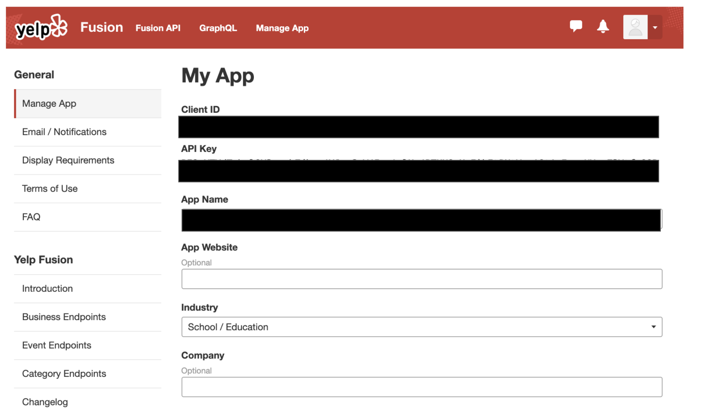
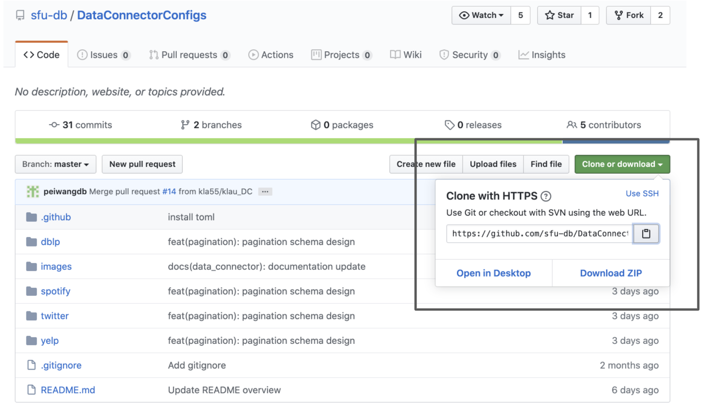
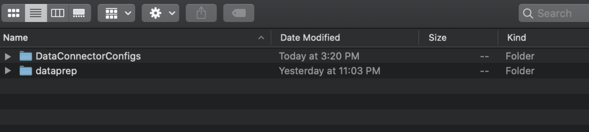
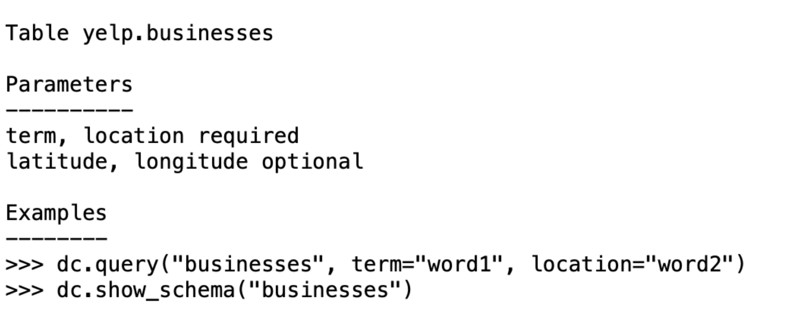
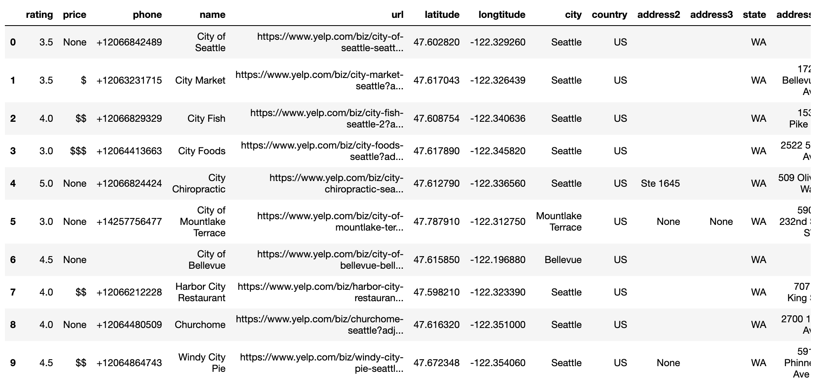

==================================================
Tutorial - Data Connector for Yelp 
==================================================

.. toctree::
   :maxdepth: 2

Overview
========

data_connector is a component in the dataprep library that aims to simplify the data access by providing a standard API set. 
The goal is to help the users skip the complex API configuration. In this tutorial, we demonstrate how to use 
data_connector library with Yelp.

Preprocessing
================
If you haven't installed dataprep, run command pip install dataprep or execute the following cell.

::

    !pip install dataprep
    
Obtaining access token from Yelp
=============================================
To connect to Yelp, you need to generate a token. This token is a unique identifier of an application requesting access to 
Yelp's API. Once an application creates the token, it will act as your credential when making an API request.

To receive an access token, the user needs to create a server-side application from Yelp, this can be done by  
visiting the `Yelp API documentation
<https://www.yelp.com/developers/documentation/v3/authentication>`_, entering some information about its use and generating a key.

.. image:: _static/images/tutorial/Yelp_authentication.png
	:align: center
   	:width: 700
   	:height: 500

Store the token or API Key in a secure location as it will be used to provide you access to the Yelp's restaurant data.

Download and store the configuration files in dataprep 
================================================================
The configuration files are used to construct the parameters and initial setup for the API. The available configuration files can be manually downloaded here: `Configuration Files
<https://github.com/sfu-db/DataConnectorConfigs>`_ or automatically downloaded at usage. 

To automatically download at usage, click on the clipboard button, unsure you are cloning with HTTPS. Go into your terminal, and find an appropriate locate to store the configuration files. 
When you decided on a location, enter the command ``git clone https://github.com/sfu-db/DataConnectorConfigs.git``. This will clone the git repository to the desired location; as a suggestion store it with the dataprep folder. 

From here you can proceed with the next steps.

.. image:: _static/images/tutorial/dc_git_clone.png
	:align: center
   	:width: 725
   	:height: 125

Below the configuration file are stored with dataprep. 

    
Initialize data_connector
=============================
To initialize run the following code. Copy and paste the Yelp API key into the **access_token** variable and ensure the connector path is correct. Once you have that running, you can use the built in functions available in connector.

::

    from dataprep.data_connector import Connector
    access_token = “insert_token_key”
    dc = Connector("./DataConnectorConfigs/yelp", _auth={"access_token":access_token})
    
Functionalities
===================
Data connector has several functions you can perform to gain insight on the data downloaded from Yelp.

Connector.info
------------------
| The info method gives information and guidelines on using the connector. There are 3 sections in the response and they are table, parameters and examples.
|
| 	a. Table - The table(s) being accessed.
| 	b. Parameters - Identifies which parameters can be used to call the method. 
| 	c. Examples - Shows how you can call the methods in the Connector class.

::

    dc.info()
    

Parameters
**********************
| A parameter is a piece of information you supply to a query right as you run it. The parameters for Yelp's business query can either be required or optional. The required parameters are **term** and **location** while the optional parameters are **latitude**, **longitude** and **limit**. The parameters are described below.
|
| 	a. **term** - Required - Search term, for example "food" or "restaurants". The term may also be business names, such as "Starbucks". 
| 	b. **location** - Required - Maximum number of search results (hits) to return. 
| 	c. **latitude** - Optional - Latitude of the location you want to search nearby.
| 	d. **longitude** - Optional - Longitude of the location you want to search nearby.
| 	e. **limit** - Number of business results to return. By default, it will return 20. Maximum is 50.

There are additional parameters to query with Yelp. If you are interested in reading up the other available parameters and setting up your own config files, please read this `Yelp link
<https://www.yelp.ca/developers/documentation/v3/business_search3>`_ and this `Configuration Files link
<https://github.com/sfu-db/DataConnectorConfigs>`_.

Connector.show_schema
-----------------------------
The show_schema method returns the website data in a Dataframe format. There are two columns in the response. The first column is the name and the second is the datatype.
As an example, lets see what is in the publication table.

::

    dc.show_schema("business")

.. image:: _static/images/tutorial/dc_schema.png
	:align: center
   	:width: 202
   	:height: 404
    
Connector.query
------------------
The query method downloads the website data. The parameters must meet the requirements as indicated in connector.info for the operation to run.

When the data is received from the server, it will either be in a JSON or XML format. The data_connector reformats the data in pandas Dataframe for the convenience of downstream operations.

As an example, let's try to get the data from the "business" table, providing the term "city" and location "seattle".

::

    dc.query("businesses", term = "city", location = "seattle", limit = 10)
    

    
From query results, you can see how easy it is to download the restaurant data from Yelp into a pandas Dataframe.
Now that you have an understanding of how data connector operates, you can easily accomplish the task with two lines of code.

::

    dc = Connector(...)
    dc.query(...)

Pagination
===================
| Another feature available in the config files is pagination. Pagination is the process of dividing a document into discrete pages, breaking the content into pages and allow visitors to switch between them. It returns the maximum number of searches to return. 
| 
| To use pagination, you need to include **_count** in your query.

::

    dc.query("business", term = "city", location = "seattle",  _count = 200)

.. image:: _static/images/tutorial/dc_yelp_query_pag.png
	:align: center
   	:width: 1000
   	:height: 500
    
Pagination does not concurrently work with the **limit** parameter in a query, you need to select either **limit** or **_count**. If you select **_count**, it bypasses the initial restriction set by Yelp's **limit** parameter.  

That's all for now.
===================
Please visit the other tutorials that are available if you are interested in setting up a different data connector. 
If you are interested in writing your own configuration file or modify an existing one, refer to the `Configuration Files
<https://github.com/sfu-db/DataConnectorConfigs>`_.

