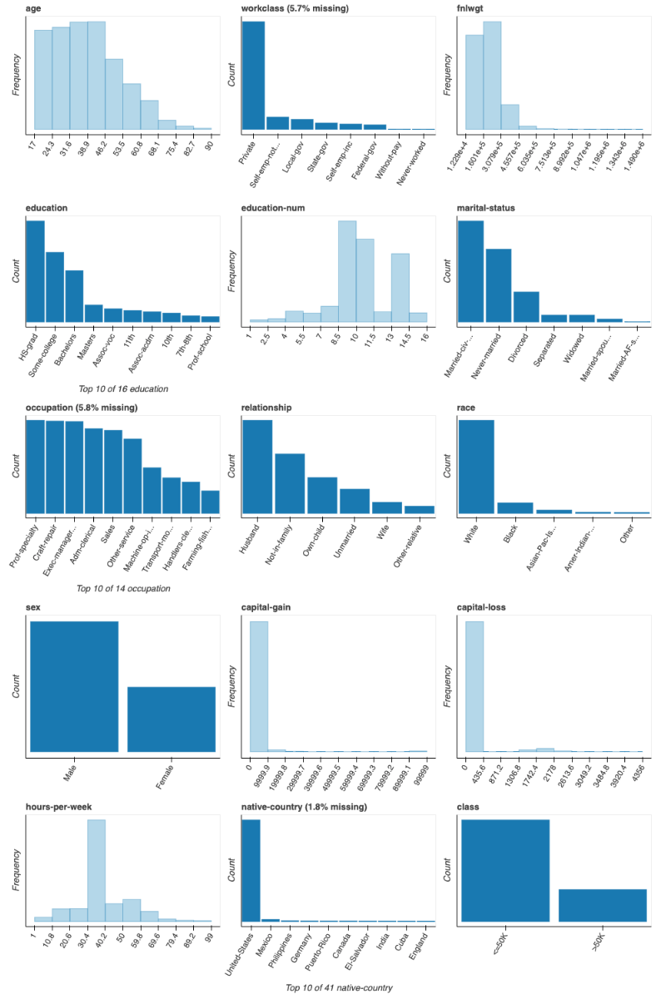
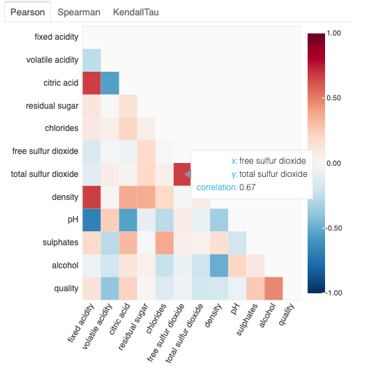

.. _introduction:

An introduction to exploratory data analysis with `dataprep.eda`
=====================================================

.. toctree::
   :maxdepth: 4

   :caption: Contents:

.. topic:: Section contents

    In this section, we introduce how to do exploratory data analysis throughout `dataprep.eda` and give serval
    simple examples.

Exploratory data analysis: functionality description
-------------------------------------

`Exploratory data analysis (EDA)  <https://www.wikiwand.com/en/Exploratory_data_analysis>`_ is the procedure of exploring the dataset and summarize its main characteristics. The goal of `dataprep.eda` module is to simplify this procedure and allow user explore important characteristics as many as possible via only a few APIs. Each API allows user analyze dataset from high level to low level from different perspective. Specifically, we provide the following functionalities:

* **analyzing basic characteristics via `plot`**: we provide an API `plot` to allow user analyze the basic characteristic of the dataset. It plots the distribution or bar chart for each column to give user a basic sense of the dataset.  If user is interested in one or two specific columns, it provides a more detailed plot for the specific columns by passing column names as the parameter. 

* **analyzing correlation between columns via `plot_correlation`**: We provide an API `plot_correlation` to analyze the correlation between columns. It plots the correlation matrix between columns. If user is interested the correlated columns for a specific column, e.g., the most correlated columns to column 'A', the API can provide a more detailed analysis by passing column names as the parameter.

* **analyzing the impact of missing values via `plot_missing`**: We provide an API `plot_missing` to analyze the pattern and impact of missing values. At the first glace, it shows the position of missing values, which allows user be aware of data quality for each column or find any underlying pattern of missing values. To understand the impact of missing values from a specific column, user can pass the column name into the parameter. It will compare the distribution of each column with and without missing values from the given column, such that user could understand the impact of the missing values.

In the following, we simply introduce `plot`, `plot_correlation` and `plot_missing` and demonstrate their basic functionalities. 

.. _demo:

Analyzing basic characteristics via `plot` 
--------------------------

To analyze the basic characteristics of the dataset, such as the distribution of each column, user could call `eda.plot`. It mainly provides the following functionalities:

1. plot(df): plot basic characteristics (the histogram and the bar chart) for all columns.
2. plot(df, x): zoom into column x and plot more refined characteristics.
3. plot(df, x, y): zoom into column x and column y, and plot more refined characteristics to explore their relationship.

In the following, we show an example of `plot(df)`, which plots the histogram for each numerical column and bar chart for each categorical column ::

  from dataprep.eda import plot
  import pandas as pd
  df = pd.read_csv("https://www.openml.org/data/get_csv/1595261/phpMawTba", na_values = [' ?'])
  plot(df)

Analyzing correlation via `plot_correlation`
------------------------
To analyze the correlation between columns, we provide `plot_correlation`. Its main functionalities could be summarized as follows:

1. `plot_correlation(df)`: plot the correlation matrix of all columns.
2. `plot_correlation(df, x)`: plot the most correlated columns to column x.
3. `plot_correlation(df, x, y)`: plot the scatter plot between column x and column y, as well as the regression line. Besides, the point that has most impact on the correlation value could be identified by passing a parameter.
4. `plot_correlation(df, x, y, k, value_range)`: filter the result by correlation value or by top-k.

In the following, we show an example of `plot_correlation(df)`, which plots the correlation matrix for `Person  <https://www.wikiwand.com/en/Pearson_correlation_coefficient>`_, `Spearman  <https://www.wikiwand.com/en/Spearman%27s_rank_correlation_coefficient>`_ and `KendallTau  <https://www.wikiwand.com/en/Kendall_rank_correlation_coefficient>`_ correlation::

  from dataprep.eda import plot_correlation
  import pandas as pd
  df = pd.read_csv("https://archive.ics.uci.edu/ml/machine-learning-databases/wine-quality/winequality-red.csv", sep = ";")
  plot_correlation(df)

Analyzing missing values via `plot_missing`
-----------------
To analyze the pattern and impact of missing values, we provide `plot_missing`. Its main functionalities could be summarized as follows:

1. `plot_missing(df)`: plot the position of missing values.
2. `plot_missing(df, x)`: plot the impact on basic characteristics (histogram and bar chart) of missing values in column x to all other columns.
3. `plot_missing(df, x, y)`: zoom into column y, and plot the impact on more characteristics of missing values in column x to column y.  

In the following, we show an example of `plot_missing(df)`, which shows the positions of missing values as well as the percentage of missing value in each column::

  from dataprep.eda import plot_missing
  import pandas as pd
  df = pd.read_csv("https://www.openml.org/data/get_csv/16826755/phpMYEkMl", na_values = ['?'])
  plot_missing(df)

.. image:: images/introduction/plot_missing.png
   :align: center
   :scale: 100