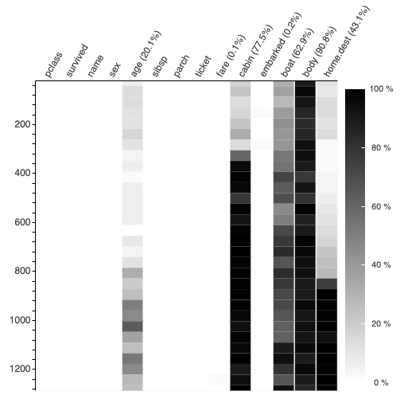
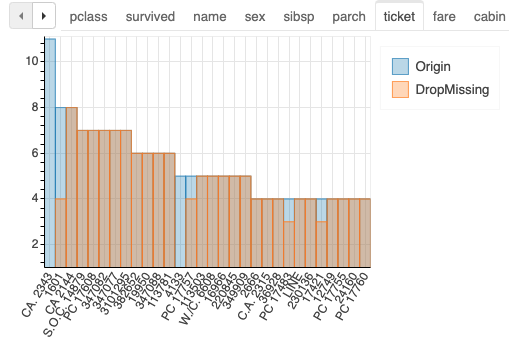
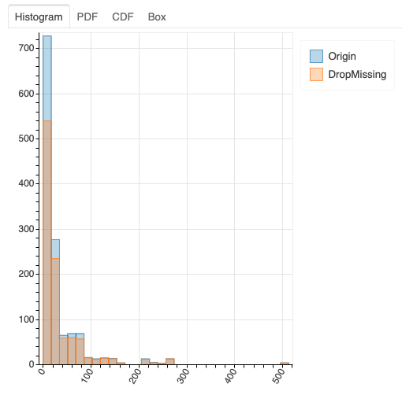
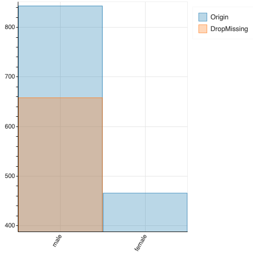

.. _linear_model:

=============
`plot_missing`: analyzing the impact of missing values
=============

.. toctree::
   :maxdepth: 4

Overview
===============

The goal of `plot_missing` is to analyze the impact of missing values. The impact means the change of characteristics (e.g., histogram for numerical column or bar chart for categorical column) of the dataset before and after removing the rows with missing values. `plot_missing` mainly provides the following functionalities:

1. `plot_missing(df)`: plot the position of missing values.
2. `plot_missing(df, x)`: plot the impact on basic characteristics (histogram and bar chart) of missing values in column x to all other columns.
3. `plot_missing(df, x, y)`: zoom into column y, and plot the impact on more characteristics of missing values in column x to column y.  

In the following, we use several examples to demonstrate the functionalities.

Loading dataset
=======================
We support two types of dataframe: pandas dataframe and dask dataframe. Here we load the well known `tantic` dataset into a pandas dataframe and use it to demonstrate our functionality::

    import pandas as pd
    df = pd.read_csv("https://www.openml.org/data/get_csv/16826755/phpMYEkMl", na_values = ['?'])

Plotting the position of missing values via `plot_missing(df)`
==========================================

Given a dataset, we could plot the position of missing values via plot_missing(df). The dataset is divided into bins, and we use colored bin to represent the number of missing values. The more the missing value is in a bin, the deeper the bin color is. By default, we show 50 columns and each column is divided into 100 bins. We will also show the percentage of missing values for each column in the label. The following is an example::

    from dataprep.eda import plot_missing
    plot_missing(df)

The impact on basic characteristics of missing values in column x via `plot_missing(df, x)`
==========================================

After we know the position of the missing value, we could further analyze the impact of missing values. We provide `plot_missing(df, x)` to analyze the impact of missing values in column x. The impact means the characteristics of dataset before and after removing the missing values. Here, we consider two types of characteristics: the histogram for numerical column and the bar chart for categorical column. When calling `plot_missing(df, x)`, user could see the difference of histogram for numerical columns and the bar chart for categorical column, before and after removing the missing values of column x. The following shows an example::
    
    plot_missing(df, "age")

The impact on more characteristics of missing values in column x to column y via `plot_missing(df, x, y)`
========================================

`plot_missing(df, x)` only considers two types of characteristics, i.e., histogram and bar chart, for all columns. If user wants to zoom into a specific column and analyze the impact on more characteristics, she/he could call `plot_missing(df, x, y)`. `plot_missing(df, x, y)` plots the impact of the missing values in x column on y column. The output plot is different when y is numerical column or categorical column. 

When y is numerical column, `plot_missing(df, x, y)` shows the impact on histogram, pdf, cdf, and box plot. The following shows an example:: 

    plot_missing(df, "age", "fare")

When y is categorical column, `plot_missing(df, x, y)` shows the impact on bar chart. The following shows an example:: 

    plot_missing(df, "age", "sex")

