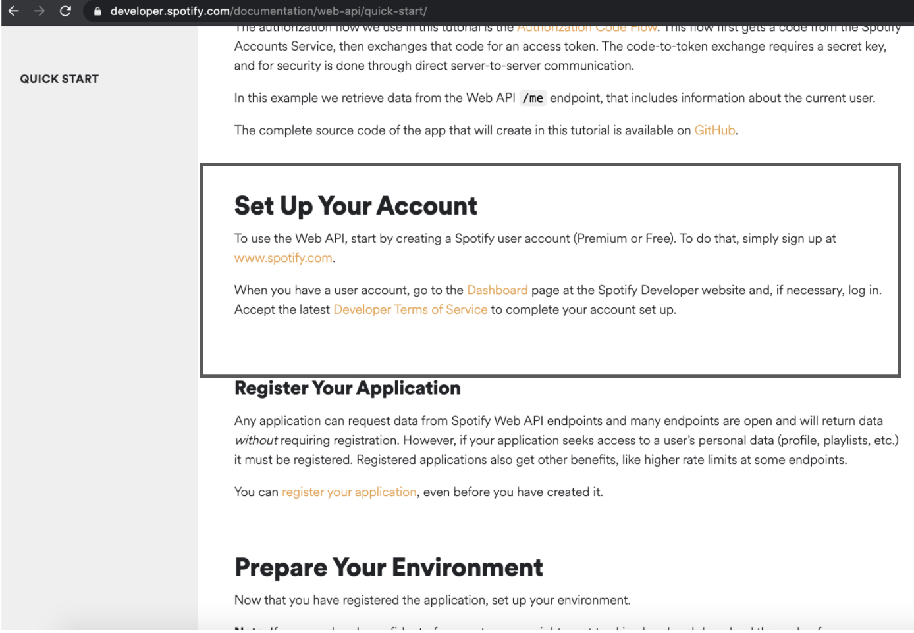
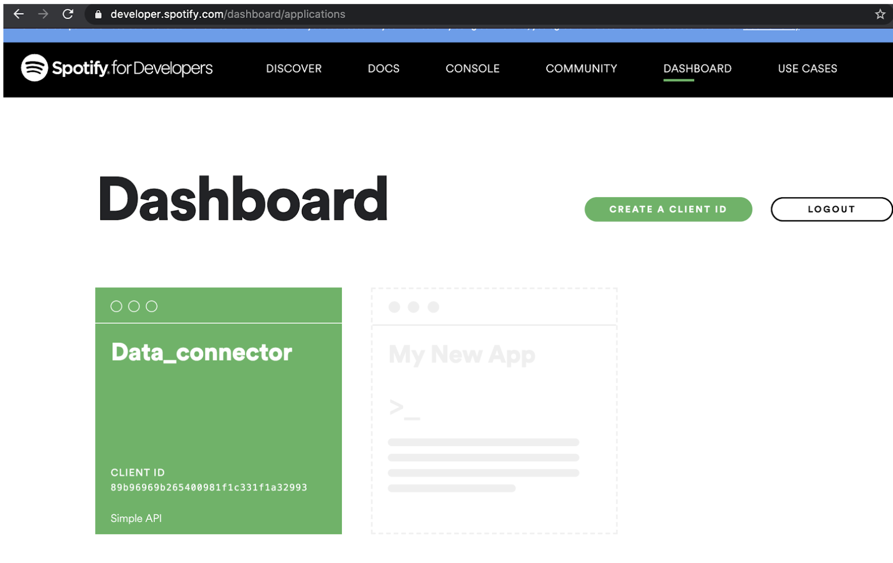
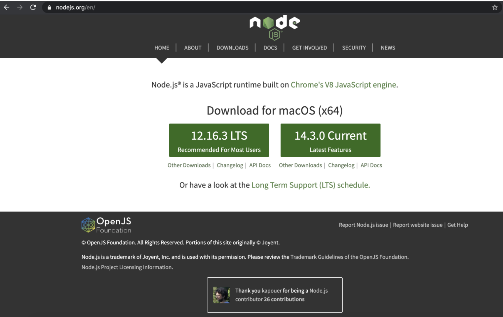
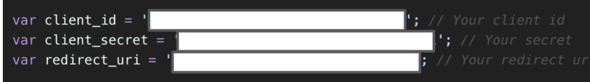
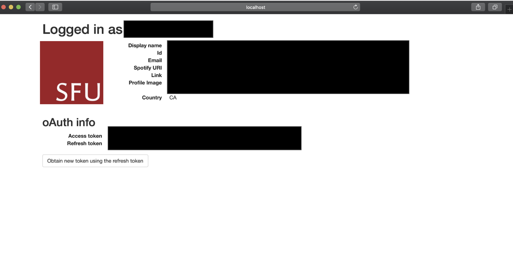
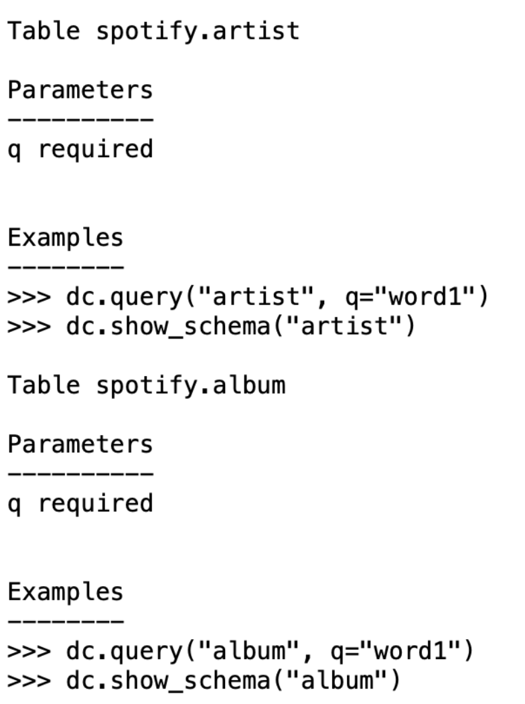
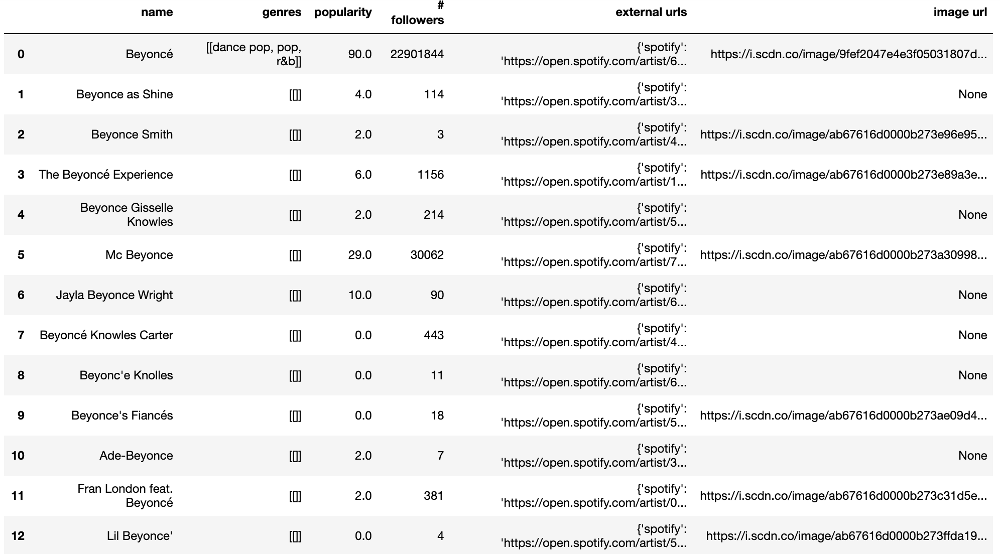

==================================================
Tutorial - Connector for Spotify 
==================================================

.. toctree::
   :maxdepth: 2

Overview
========

Connector is a component in the DataPrep library that aims to simplify the data access by providing a standard API set. The goal is to help the users skip the complex API configuration. In this tutorial, we illustrate how to use connector library with Spotify.

Preprocessing
================
If you haven't installed DataPrep, run command pip install dataprep or execute the following cell.

::

    !pip install dataprep
    
Obtaining access token from Spotify
==================================================
To connect to Spotify, you need to generate a token. This token is a unique identifier of an application requesting access to the Spotify's API. Once an application creates the token, it will act as your credential when making an API request.
To receive an access token the user needs to create a server side application from Spotify. You can create a token by following the `Spotify document
<https://developer.spotify.com/documentation/web-api/>`_, or through the comprehensive guide below.

Start by setting up a Spotify Developer account.

Once an account is created, click the “Dashboard” link and register a new application. Name and describe the application as you want.

Proceed to `Spotify’s GitHub account
<https://developer.spotify.com/documentation/web-api/>`_ and download/clone the Authentication Flow example app code.
If the clone was successful, a new sub-directory appears on your local drive in the directory where you cloned your repository.

.. image:: ../../_static/images/tutorial/Spotify_git_page.png
	:align: center
   	:width: 650
   	:height: 400

Download and install `Node.js
<https://nodejs.org/en/>`_, if you have not done so already. 

Providing the Credentials
---------------------------
In the web-api-auth-examples folder, navigator to the authorization_code folder and there is a file called apps.js.

.. image:: ../../_static/images/tutorial/App_find.png
	:align: center
   	:width: 650
   	:height: 330

Open apps.js with your favourite editor. In the file, it contains a section for client ID, client secret, and redirect URI. Insert the information available in the "white out" section. This is the call that starts the process of authenticating to user and gets the user’s authorization to access data.

The client ID and client secret can be found in the dashboard app the user generated. The client ID is a public information for applications. The client secret must be kept confidential, it is used to verify that your request made with the client ID are authorized.

.. image:: ../../_static/images/tutorial/ID_and_secret.png
	:align: center
   	:width: 600
   	:height: 350

Go back to the application dashboard and click the edit settings which can be found on the top right. In this section, insert the http link in the redirect_uri, "http://localhost:8888/callback". The redirect URI will safely send the user back to their application once Spotify has authorized the app. Copy and store the access token in a safe area.

.. image:: ../../_static/images/tutorial/URI_.png
	:align: center
   	:width: 300
   	:height: 400

Running the Application
---------------------------
Start the server by running the following command in the terminal:

::

    node app.js

Open a browser and visit the project home page again. Now that the server is running, you can use the following URL: http://localhost:8888.

.. image:: ../../_static/images/tutorial/Spotify_server.png
	:align: center
   	:width: 800
   	:height: 400

When you click on the log in link, it will send you back to your redirect URI. You should see your Spotify account information as well as your access token and refresh token.

Download and store the configuration files in DataPrep
======================================================
The configuration files are used to construct the parameters and initial setup for the API. The available configuration files can be manually downloaded here: `Configuration Files
<https://github.com/sfu-db/DataConnectorConfigs>`_ or automatically downloaded at usage. 

To automatically download at usage, click on the clipboard button, unsure you are cloning with HTTPS. Go into your terminal, and find an appropriate locate to store the configuration files. 
When you decided on a location, enter the command ``git clone https://github.com/sfu-db/DataConnectorConfigs.git``. This will clone the git repository to the desired location; as a suggestion store it with the DataPrep folder. 

From here you can proceed with the next steps.

.. image:: ../../_static/images/tutorial/dc_git.png
	:align: center
   	:width: 1000
   	:height: 500

.. image:: ../../_static/images/tutorial/dc_git_clone.png
	:align: center
   	:width: 725
   	:height: 125

Below the configuration file are stored with DataPrep. 

.. image:: ../../_static/images/tutorial/Config_destination.png
	:align: center
   	:width: 586
   	:height: 132

    
Connector.info
------------------
| The info method gives information and guidelines on using the connector. There are 4 sections in the response and they are table, parameters, example and schema.
|
| 	a. Table - The table(s) being accessed.
| 	b. Parameters - Identifies which parameters can be used to call the method. 
| 	c. Examples - Shows how you can call the methods in the Connector class.
|   d. Schema - Names and data types of attributes in the response.

::

    from dataprep.connector import connect, info
    info('./DataConnectorConfigs/spotify')

   	
After a connector object has been initialized (see how below), info can also be called using the object::

	dc.info()

Parameters
**********************
| A parameter is a piece of information you supply to a query right as you run it. The parameters for Spotify's album query can either be required or optional. The required parameter is **q** while the optional parameters are **limit** and **offset**. The parameters are described below.
|
| 	a. **q** - Required - Search term, for example "Beyonce". 
| 	b. **limit** - Optional -  It is the maximum number of results to return. By default, it will return 20. Maximum is 50.
| 	c. **offset** - Optional - Offset allows you to specify the ranking number of the first item on the page. By default, it will return 0. Maximum is 2,000.

There are additional parameters to query with Spotify. If you are interested in reading up the other available parameters and setting up your own config files, please read this `Spotify link
<https://developer.spotify.com/documentation/web-api/reference/search/search/>`_ and this `Configuration Files link
<https://github.com/sfu-db/DataConnectorConfigs>`_.

Initialize connector
=============================
To initialize the connector, run the following code below. Copy and paste your Spotify **access_token**, **client_id**, and **client_secret** in the appropriate variables. Once you have that running, you can use some of the built in functions available in connector.

::

    client_id = “insert_client_id”
    client_secret = “insert_client_secret”
    access_token = “insert_token_key”
    dc = connect("./DataConnectorConfigs/spotify", _auth={"client_id":client_id, 
                                                           "client_secret":client_secret, 
                                                           "access_token":access_token})

    
Connector.query
------------------
The query method downloads the website data and displays it in a Dataframe. The parameters must meet the requirements as indicated in connector.info for the operation to run.

When the data is received from the server, it will either be in a JSON or XML format. The connector reformats the data in pandas Dataframe for the convenience of downstream operations.

As an example, let's try to get the data from the "artist" table, providing the query search for the artist "beyonce".

::

    dc.query("artist", q="beyonce")
    

    
From query results, you can see how easy it is to download the artist data from Spotify into a pandas Dataframe.
Now that you have an understanding of how connector operates, you can easily accomplish the task with two lines of code.

::

    dc = Connector(...)
    dc.query(...)

Pagination
===================
| Another feature available in the config files is pagination. Pagination is the process of dividing a document into discrete pages, breaking the content into pages and allow visitors to switch between them. It returns the maximum number of searches to return. 
|
| To use pagination, you need to include **_count** in your query. The **_count** parameter represents the number of records a user would like to return, which can be larger than the maximum limit of records each return of API itself. Users can still fetch multiple pages of records by using parameters like limit and offset, however this requires users to understand how pagination works different website APIs.
|

::

    dc.query("artist", q="twice", _count=200)

.. image:: ../../_static/images/tutorial/dc_spotify_query_pag.png
	:align: center
   	:width: 1000
   	:height: 490    
    
Pagination does not concurrently work with the **limit** parameter in a query, you need to select either **limit** or **_count**. If you select **_count**, it bypasses the initial restriction set by Spotify's **limit** parameter.  

    
That's all for now.
===================
Please visit the other tutorials that are available if you are interested in setting up a connector.
If you are interested in creating other connectors, please visit this `link
<https://github.com/sfu-db/DataConnectorConfigs>`_.

