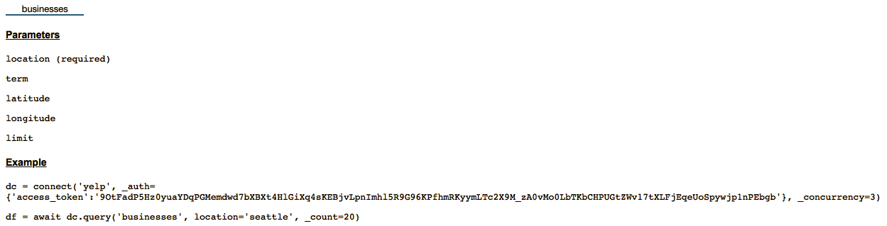
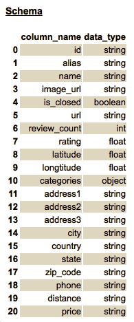
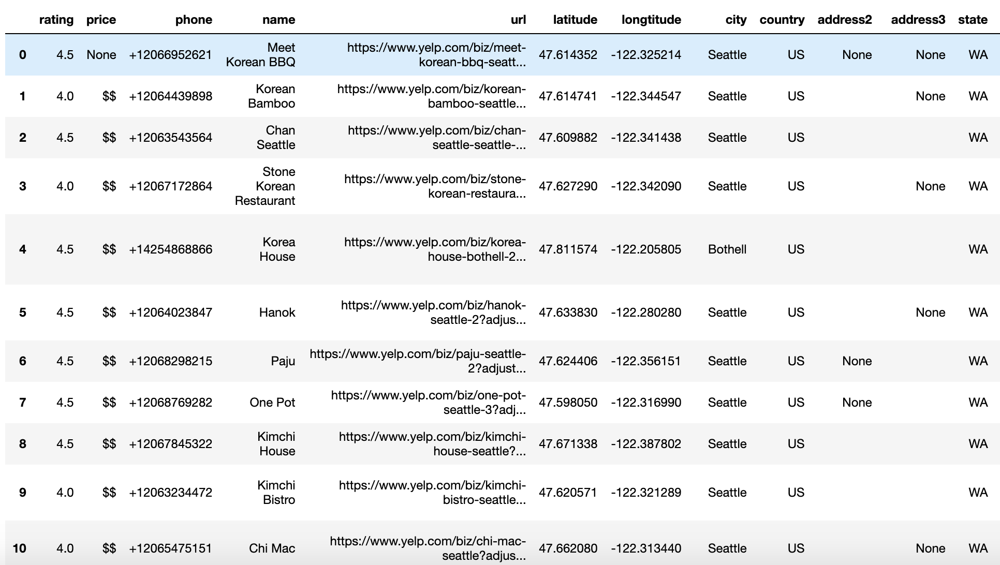

.. _dataconnector:

=========
Connector
=========

.. toctree::
    :maxdepth: 1

    DC_DBLP_tut
    DC_Spotify_tut
    DC_Yelp_tut

Overview
==========
Connector is a component in the DataPrep library that aims to simplify the data access by providing a standard API set. 
The goal is to help the users skip the complex API configuration.
We illustrate how to use connector library with Yelp.

Getting the guideline of the connector with `Connector.info`
=================================================================
| The info function gives information and guidance for using connector. In the example below, the response shows four things. 
| 	a. There is one table in Yelp, i.e. businesses.
| 	b. To query this table, the location parameter is required. The term, latitude, longitude and limit parameters are optional (see Connector.query() section).
| 	c. Examples of calling functions with the Connector class.
|   d. Schema of data to be returned in a dataframe. The first column contains attribute names and the second contains the type of data.

::

    from dataprep.connector import connect, info
    info('./DataConnectorConfigs/yelp')
    

   	
After a connector object has been initialized (see how below), info can also be called using the object::

	dc.info()

Initializing a connector object for a website
=============================================
The first step is to initialize a Connector object with the configuration file location and access token specified (`How to get access token?
<https://www.yelp.com/developers/documentation/v3/authentication>`_).
Available configuration files can be manually downloaded here: `Configuration Files
<https://github.com/sfu-db/DataConnectorConfigs>`_ or automatically downloaded at usage.
To initialize a connector::

    dc = connect('yelp', _auth={'access_token':{insert_value}})

Getting web data with `Connector.query()`
=================================================
the `query()` method downloads the website data.
The parameters should meet the requriement in `Connector.info`
Usually the raw data is returned in JSON or xml format.
connector re-format the data in pandas dataframe for the convenience of downstream operations.

::

    df = dc.query('businesses', term="korean", location="seattle")
    df

Advanced: writing your own connector configuration file
==============================================================
A configuration file defines the information necessary to fetch data from a website, e.g. the request URL, API authorization type, parameters needed from the users (API key, search keyword, etc.), the returned data's schema. 
All the information is reusable.
To write a configuration file for the your own needs or modify an existing one, please refer to `Configuration Files
<https://github.com/sfu-db/DataConnectorConfigs>`_.
