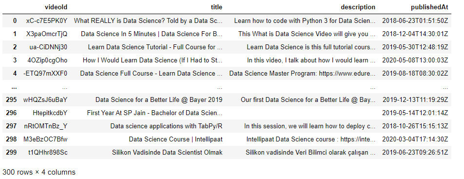

==================================================
Concurrency in Connector
==================================================

.. toctree::
   :maxdepth: 2

Overview
========
Connector implements a mechanism to accelerate the data request process through a parallelism-based implementation. This feature allows users to retrieve data, in parallel, in less time.

Concurrency in context: Youtube
================================================================
YouTube API provides several engaging endpoints, for example, the "videos" endpoint, which returns a collection of relevant videos matching a specified query.
To start, let's review the existing configuration file for the "videos" endpoint available `here <https://github.com/sfu-db/DataConnectorConfigs/blob/develop/youtube/videos.json>`_::

    {
    "version": 1,
    "request": {
        "url": "https://www.googleapis.com/youtube/v3/search",
        "method": "GET",
        "authorization": {
            "type": "QueryParam",
            "keyParam": "key"
        },
        "params": {
            "q": true,
            "part": true,
            "type": false,
            "maxResults": false,
            "pageToken": false
        },
        ...
    }

As you can see in the "params" property, five parameters are defined for this endpoint: ``q`` and ``part`` are mandatory, and the remaining ones are optional: ``type``, ``maxResults``, and ``pageToken``. See more details on the YouTube API specification webpage.
Employing the ``q`` parameter, you can put any string to search. The ``part`` parameter indicates the resource that the API response will include. It must always be set to ``snippet``.

Now, you can execute the query::

    import asyncio
    from dataprep.connector import connect
    youtube_connector = connect("youtube", _auth={"access_token":"<Your YouTube access token>"})
    df = await youtube_connector.query("videos", q="data science", part="snippet")

Let's review the obtained results:

.. image:: ../../_static/images/connector/connector_youtube_query.png
	:align: center
   	:width: 964
   	:height: 181

For the "videos" endpoint, by default, the maximum number of search results to return for each request is 5. However, with Connector, you can also specify the desired record number you want to get by including the ``_count`` argument.

Now, let's add the ``_count`` argument to the ``query`` function and give it “300” as a value::

    import asyncio
    from dataprep.connector import connect
    youtube_connector = connect("youtube", _auth={"access_token":"<Your YouTube access token>"})
    df = await youtube_connector.query("videos", q="data science", part="snippet", _count=300)

Let's execute this query again:

As you can see, the result includes exactly 300 records! (see more details about the auto-pagination feature in the :ref:`connector_pagination` section of this guide).

However, when the query is executed, it is noticeable that the execution time is perceptibly longer. This event occurred because the ``_count`` argument value was increased, and therefore, more requests are issued to the underlying API to retrieve the desired data.

To alleviate this problem, in the next section, we'll introduce the concurrency feature in Connector.

Concurrency: Enabling Connector to issue requests in parallel
================================================================

Connector offers the ``_concurrency`` parameter as part of the ``connect`` function. Its objective is to accelerate the query execution process when many requests must be sent out, as is the case when the ``_count`` parameter is used with a significant value.

By default, the ``_concurrency`` setting is "1", which means that Connector will send out one request per second. However, if this value is increased to, let's say, 10, Connector will send out ten requests in one second::

    import asyncio
    from dataprep.connector import connect
    youtube_connector = connect("youtube", _auth={"access_token":"<Your YouTube access token>"}, _concurrency=10)
    df = await youtube_connector.query("videos", q="data science", part="snippet", _count=300)

